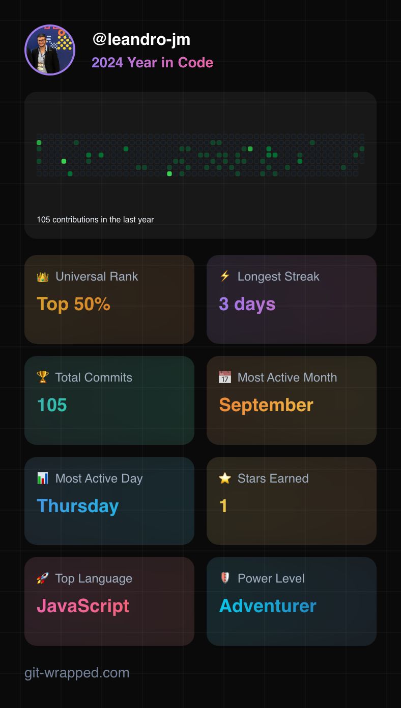

# About me

👋 Meu nome é Leandro, sou um Arquiteto de Software e Desenvolvedor versátil com mais de 14 anos de experiência na entrega de soluções impactantes em diversos domínios, incluindo setor público, serviços financeiros, saúde e laboratórios de inovação. Profundo conhecimento em Node.js, React.js, Spring Boot e AWS Cloud, especializado em criar arquiteturas escaláveis, liderar iniciativas de inovação e desenvolver aplicações centradas no usuário. Principais conquistas incluem o design de sistemas bancários core, implementação de soluções B2B e construção de Provas de Conceito (POCs) para PIX, Open Banking e Contas Digitais.

----

👋 My name is Leandro, I am a versatile Software Architect and Developer with over 14 years of experience delivering impactful solutions in diverse domains, including public sector, financial services, healthcare, and innovation labs. Proficient in Node.js, React.js, Spring Boot, and AWS Cloud, I specialize in creating scalable architectures, leading innovation initiatives, and developing user-centric applications. Key achievements include designing core banking systems, implementing B2B solutions, and building Proof of Concepts (POCs) for PIX, Open Banking, and Digital Accounts.

# My network

Linkedin: https://www.linkedin.com/in/leandrojmartins/
Portuguese Blog: https://medium.com/@leandro.jm
English Blog: https://leandromartins.hashnode.dev/

<!---
leandro-jm/leandro-jm is a ✨ special ✨ repository because its `README.md` (this file) appears on your GitHub profile.
You can click the Preview link to take a look at your changes.
--->
